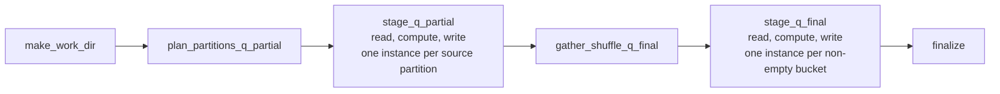

# sql-as-dag

Compile a SQL query into an Apache Airflow DAG — a small, legible distributed SQL engine that runs
on Airflow, with per-partition execution delegated to
[Apache DataFusion](https://datafusion.apache.org/).

A SQL query is a directed acyclic graph of relational operators. So is an Airflow DAG. This project
takes that literally: each relational operator becomes Airflow tasks, per-partition parallelism is
expressed with dynamic task mapping, and the shuffle between stages is Parquet files moved through
Airflow's `ObjectStoragePath`, MapReduce-style. The result is a query engine whose every internal
step — scan, map-side aggregate, shuffle write, reduce, commit — is a task you can watch, retry, and
inspect in the Airflow grid.

The goal is legibility, not throughput. If you need a fast distributed SQL engine, use one. If you
want to *see* what one does, run a query here and watch it execute.

Companion to the Airflow Summit 2026 talk
[**"A SQL Query is Just a DAG"**](https://airflowsummit.org/sessions/2026/a-sql-query-is-just-a-dag/).

> This is a standalone, third-party Airflow **provider**, registered through the
> `apache_airflow_provider` entry point. It targets **Airflow 3+** and is managed with **uv**.

## Install

```bash
pip install sql-as-dag                 # core (Parquet)
pip install "sql-as-dag[iceberg]"      # + Iceberg source/sink connectors
```

Requires `apache-airflow>=3.0.0`, `datafusion>=51`, `pyarrow>=16.1`.

## Quickstart

```python
from datetime import datetime

from sql_as_dag.compiler import compile_sql
from sql_as_dag.dag import dag_from_stages
from sql_as_dag.ir import Sink, Source

source = Source(
    source_id="orders_src",
    table_name="orders",
    connector="parquet",
    options={"uris": ["file:///data/orders/part-0.parquet", "file:///data/orders/part-1.parquet"]},
)

graph = compile_sql(
    "SELECT customer_id, SUM(amount) AS total FROM orders GROUP BY customer_id",
    [source],
    num_buckets=4,
)

dag = dag_from_stages(
    graph,
    dag_id="orders_by_customer",
    sink=Sink("parquet", {"base_uri": "file:///tmp/out"}),
    schedule=None,
    start_date=datetime(2026, 1, 1),
)
```

That `GROUP BY` compiles into two stages, and the DAG makes the classic two-phase aggregation
visible:



The partial stage aggregates each source partition independently and hash-partitions its output by
`customer_id`; the final stage combines the partials per bucket. Because equal keys always hash to
the same bucket, the per-bucket results simply concatenate into the correct answer.

The result lands under a per-run directory — `file:///tmp/out/<run>/p*/data.parquet`, with `_SUCCESS`
beside it and a `_LATEST` file at the base naming the newest finalized run. Each run's output is
self-contained, so re-running never mixes two runs' rows together; see
[docs/connectors.md](docs/connectors.md#writes-are-scoped-to-the-run).

## What it supports

- `SELECT`, `WHERE`, projection, and column aliases.
- `GROUP BY` with `SUM`, `COUNT` (including `COUNT(*)`), `MIN`, `MAX`, and `WHERE` combined with
  `GROUP BY`.
- A single INNER equi-join on same-typed keys (on its own, without `WHERE` or `GROUP BY`), with the
  broadcast-versus-shuffle strategy chosen at run time from actual row counts.
- Runtime-adaptive shuffle width, by row count, byte size, or source partition count.
- Extensible connectors: Parquet built in, Iceberg through the `iceberg` extra.

Anything that cannot be compiled into a *correct* DAG is rejected at DAG-parse time with a clear
error rather than silently producing a wrong number. The boundaries are documented in
[docs/limitations.md](docs/limitations.md).

## Examples

Runnable demo DAGs live in [`examples/dags/`](examples/dags): passthrough, a hand-built and a
compiled `GROUP BY`, a shuffle join, a broadcast join, adaptive shuffle width, and an Iceberg sink.
Each one materializes its own small demo input, so you can drop them into an Airflow DAGs folder and
trigger them as-is. They write under a temp directory named after the DAG — the Parquet ones to
`<tmp>/<dag_id>/out/<run>/p*/data.parquet`.

## Documentation

[docs/](docs/README.md) explains how it works and why:

- [architecture.md](docs/architecture.md) — the layers and the end-to-end path
- [compiler-and-ir.md](docs/compiler-and-ir.md) — SQL to logical plan to Stage IR
- [dag-mapping.md](docs/dag-mapping.md) — stages to mapped task groups
- [shuffle.md](docs/shuffle.md) — bucketing, adaptive width, broadcast joins
- [connectors.md](docs/connectors.md) — the source/sink contract and how to add a format
- [limitations.md](docs/limitations.md) — the supported SQL subset and where it stops
- [development.md](docs/development.md) — tests, and running inside Airflow Breeze

## Development

```bash
uv sync --group dev          # create the environment
uv run pytest                # run the unit tests
uv run ruff check .          # lint
```

See [docs/development.md](docs/development.md) for running the examples and for testing the provider
inside Airflow Breeze.

## License

Apache-2.0. See [LICENSE](LICENSE) and [NOTICE](NOTICE).
