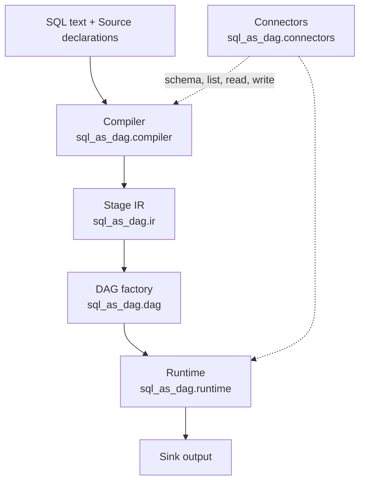
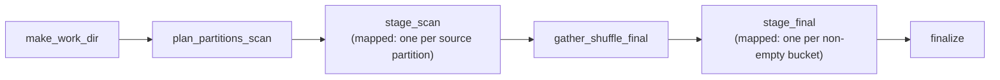

# Architecture

## Layers

The engine is four layers with deliberately narrow seams between them:



Each layer has exactly one job:

- **Compiler** — the only code that touches DataFusion's logical-plan API. It pattern-matches the
  plan and emits a `StageGraph`. See [compiler-and-ir.md](compiler-and-ir.md).
- **Stage IR** — plain dataclasses describing stages, their inputs, and how each stage's output is
  partitioned. No Airflow, no DataFusion, no I/O. This is the contract between compilation and
  execution, and it is what makes the two independently testable.
- **DAG factory** — turns a `StageGraph` into Airflow tasks. The only layer that imports
  `airflow.sdk`. See [dag-mapping.md](dag-mapping.md).
- **Runtime** — per-partition execution (DataFusion), Parquet I/O, hash partitioning, and the
  planner logic that decides fan-out. Airflow-free except for `ObjectStoragePath`.
- **Connectors** — everything format-specific: enumerate partitions, read one, write one, commit.
  See [connectors.md](connectors.md).

The layering is what makes the interesting parts unit-testable without spinning up Airflow: you can
compile a query and assert on the resulting `StageGraph`, or hand Arrow tables to the executor and
assert on the output, with no scheduler in sight.

## The end-to-end path

Two things happen at two very different times, and keeping them straight is essential to
understanding the design.

**At DAG-parse time** (every time the scheduler parses your DAG file):

1. Each `Source`'s connector is asked for its `schema()` — metadata only, no data is read.
2. DataFusion parses and plans the SQL against those schemas, which also validates it: an unknown
   column or a syntax error fails here, at parse time, not hours into a run.
3. The compiler lowers the plan to a `StageGraph`.
4. The factory builds the tasks. Task *structure* is fixed at this point; task *counts* are not.

**At run time**:

1. `make_work_dir` mints a run-scoped scratch directory (local temp dir by default, or a prefix
   under an object store).
2. Optionally, a width planner picks the shuffle width from cheap source metadata.
3. A planner task enumerates work — one entry per source partition, or one per non-empty shuffle
   bucket — and that list drives the next stage's `.expand_kwargs(...)`.
4. Each mapped stage instance runs `read` then `compute` then `write`.
5. `finalize` commits through the sink connector.



## What crosses XCom

Only metadata: file URIs, bucket ids, and row counts. Bulk data always travels as Parquet files
written through `ObjectStoragePath`. This is the single most important runtime rule — it is what
keeps the metadata database small and lets the same code run against `file://` locally and `s3://`
on real workers.

Concretely, each mapped stage instance returns a `StageOutput`:

```python
{
    "partition_id": 0,
    "files": [{"path": "file:///.../bucket_2.parquet", "bucket": 2, "rows": 1041}],
    "rows_in": 5000,
    "rows_out": 5000,
}
```

Those row counts are not just for humans — the planner tasks use them to choose the shuffle width
and to decide between a broadcast and a shuffle join. See [shuffle.md](shuffle.md).

## Why tasks are self-contained

Connectors are never captured as live objects inside a task. Each task receives the connector's
`(name, options)` and rebuilds it from the registry:

```python
connector = get_source(connector_name)(**options)
```

Airflow tasks run in separate processes, potentially on separate machines, and anything closed over
by a task must survive serialization. Passing plain names and option dicts keeps every task
independently runnable — which is also why a single failed partition can be retried on its own.

For the same reason, the shuffle hash is `blake2b`, not Python's built-in `hash()`: the latter is
randomized per process, so it would scatter identical keys into different buckets in different
tasks. See [shuffle.md](shuffle.md).
