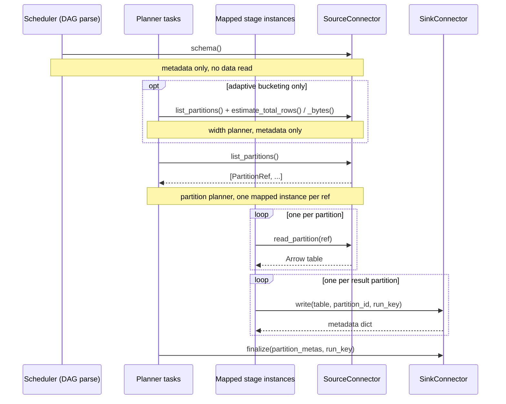

# Connectors

Connectors are the seam that keeps the compiler, the DAG factory, and the runtime format-agnostic.
Only a connector knows how to enumerate, read, or write a particular table format; adding a format
means writing one pair of classes and registering them, with no changes anywhere else in the engine.

## The contracts

Both are `Protocol`s in `sql_as_dag.connectors.base`, so there is no base class to inherit from —
structural typing is enough.

### `SourceConnector`

| Method | Called | Purpose |
| --- | --- | --- |
| `schema()` | DAG-parse time | Return the Arrow schema. Metadata only; must not read data. This is what lets the compiler plan and validate the SQL without touching the table. |
| `list_partitions()` | Run time, in a planner task | Enumerate readable partitions. Each `PartitionRef` becomes one mapped task-group instance. For Parquet, one entry per file. |
| `read_partition(ref)` | Run time, per partition | Read one partition into an Arrow table. |
| `estimate_total_rows()` | Run time, width planner | Cheap row estimate, or `None`. Metadata only. |
| `estimate_total_bytes()` | Run time, width planner | Cheap size estimate in bytes, or `None`. |

### `SinkConnector`

| Method | Purpose |
| --- | --- |
| `write(table, *, partition_id, run_key)` | Write one result partition; return JSON-serializable metadata. |
| `finalize(partition_metas, *, run_key)` | Commit after all partitions are written. |

### When each method is called

The parse-time versus run-time split is the thing to internalize: `schema()` runs on every DAG
parse, so it must be cheap and must not read data. Everything else runs inside tasks.



The `finalize` split exists for transactional formats. Parquet has nothing to do — the files are
already there — but Iceberg needs to append the written data files and commit a single snapshot, so
that either the whole query result becomes visible or none of it does. Putting the commit in its own
task also makes it visible and separately retryable.

## Writes are scoped to the run

`write` and `finalize` both receive a `run_key`: one value that identifies the DAG run and is the
same in every task of it. A sink is expected to include it in the paths it writes.

This is not tidiness, it is correctness. Paths are otherwise derived from `partition_id`, which is
the bucket id — it restarts at 0 on every run, and the number of buckets changes between runs under
an adaptive policy. Two runs sharing a directory means a run that produced fewer buckets overwrites
the first few partitions of the previous result and leaves the rest untouched, so a reader sees rows
from two different runs behind a freshly written success marker. For Iceberg it is worse: a data file
is immutable once committed, so rewriting one silently changes what an already-committed snapshot
returns.

Retries are the reason the key identifies the run rather than the attempt: a retried task recomputes
the same key and so writes to the same path, which is what makes the retry idempotent rather than
additive.

The built-ins therefore lay out:

| Sink | Layout |
| --- | --- |
| `parquet` | `<base_uri>/<run_key>/p<partition_id>/data.parquet`, `_SUCCESS` in the run directory, and a `_LATEST` file at the base naming the newest finalized run |
| `iceberg` | staged at `<warehouse>/_staging/<db>/<table>/<run_key>/p<partition_id>.parquet`, then committed to the table by `finalize` |

Each Parquet run is a self-contained, immutable result directory, so read `_LATEST` (or pick a run
directory explicitly) rather than globbing the base. Iceberg has no such concern — the table itself
is the current state, and each run appends a snapshot.

Calling a sink directly, outside a DAG, leaves `run_key` as `None`; the layout is then the flat
un-scoped one and the caller owns the collision risk.

## Two hard constraints

**A `PartitionRef` must survive XCom.** It is produced by a planner task and consumed by a
per-partition task in a different process, so it is a plain `dict`. Its internal shape is entirely up
to the connector — `{"uri": "..."}` for Parquet, something else elsewhere — and the planner treats it
as opaque.

**Connectors must be reconstructible from `(name, options)`.** Tasks never receive a live connector
object; they receive the registered name and an options dict and rebuild it via the registry. This
is what keeps each task independently serializable and runnable, and it is why `Source` and `Sink`
hold plain data rather than instances.

**Connectors know nothing about Airflow.** They take and return Arrow tables and plain dicts, which
means they are unit-testable with no DAG, no scheduler, and no database.

## The registry

Importing `sql_as_dag.connectors` registers the built-ins:

| Name | Source | Sink | Requires |
| --- | --- | --- | --- |
| `parquet` | `ParquetSourceConnector` | `ParquetSink` | built in |
| `iceberg` | `IcebergSourceConnector` | `IcebergSink` | `pip install "sql-as-dag[iceberg]"` |

The Iceberg classes import `pyiceberg` lazily, so registration does not require the optional extra to
be installed — you only need it if you actually use an Iceberg source or sink.

## Adding a format

```python
import pyarrow as pa
from sql_as_dag.connectors import register_source


class MyFormatSource:
    def __init__(self, **options):
        self._options = options

    def schema(self) -> pa.Schema:
        ...  # metadata only

    def list_partitions(self) -> list[dict]:
        return [{"chunk": i} for i in range(self._num_chunks())]

    def read_partition(self, ref: dict) -> pa.Table:
        return self._read_chunk(ref["chunk"])

    def estimate_total_rows(self) -> int | None:
        return None

    def estimate_total_bytes(self) -> int | None:
        return None


register_source("myformat", MyFormatSource)
```

Then reference it by name:

```python
Source(source_id="s", table_name="events", connector="myformat", options={...})
```

How you choose to partition is the interesting design decision, because `list_partitions()` directly
determines the map-side parallelism: one ref, one task. Files, row groups, or key ranges are all
reasonable; just keep the refs small, since they travel through XCom.
