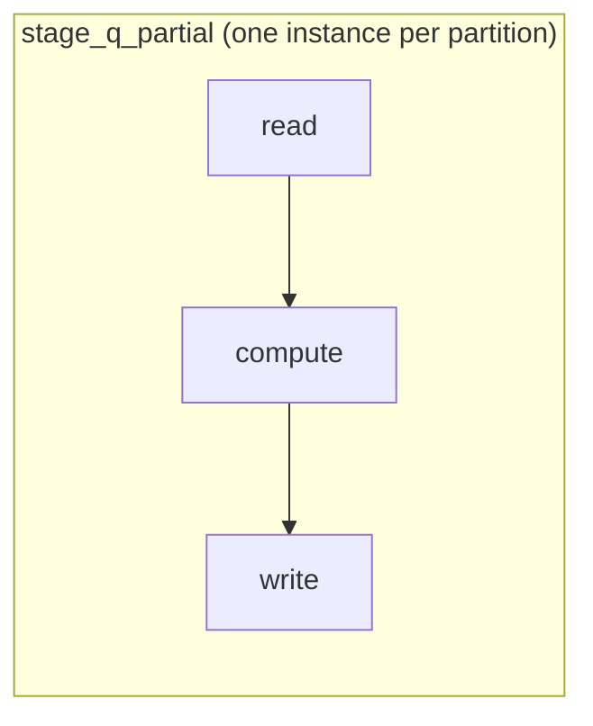

# Mapping stages onto an Airflow DAG

`dag_from_stages()` consumes a `StageGraph` and produces a DAG. This document explains the shape it
produces and why.

## One stage, one mapped task group

Each stage becomes a `@task_group` containing three tasks, expanded once per partition:



- **`read`** — materialize this partition's inputs. Either ask the source connector for one
  partition, or concatenate the upstream Parquet files assigned to this instance. The result is
  written to a scratch Parquet file.
- **`compute`** — register the inputs under their SQL table names and run the stage's SQL through
  DataFusion. Result to another scratch file.
- **`write`** — either hand the result to the sink connector (terminal stage) or hash-partition it
  into bucket files for the next stage.

Splitting into three tasks costs two scratch writes per partition, which is not free. It buys
something more valuable for this project's purpose: each step is separately visible, separately
retryable, and separately timed in the Airflow UI. When the point is to *show* how a query engine
works, "read", "compute", and "shuffle write" being distinct boxes in the grid is the feature.

## Planner tasks decide the fan-out

Airflow needs a list to expand over, and that list cannot be known at parse time — it depends on how
many partitions the source has and how many buckets actually receive rows. So between every pair of
stages sits a small planner task whose output feeds `.expand_kwargs(...)`:

```
make_work_dir
  [plan_shuffle_width_<consumer>]   (adaptive bucketing only; one per co-partition group)
  -> plan_partitions_<stage>        (source-fed: one entry per source partition)
     OR gather_shuffle_<stage>      (shuffle-fed: one entry per non-empty bucket)
  -> stage_<stage>.expand_kwargs(read -> compute -> write)
  -> ...
  -> finalize
```

These planner tasks are the DAG's "control plane". They move only metadata, run in milliseconds, and
each one is the seam where a runtime decision gets made:

- **`plan_partitions_<stage>`** asks the source connector to `list_partitions()` and emits one kwargs
  entry per partition, carrying the partition reference, the output directory, the partition id, and
  the bucket count to shuffle into.
- **`gather_shuffle_<stage>`** groups the upstream stage's bucket files by bucket id and emits one
  entry per bucket. For a two-input stage (a join) it also picks the join strategy.
- **`plan_shuffle_width_<consumer>`** reads cheap source metadata and picks the shuffle width.

Every entry in the emitted list is a `dict` of kwargs matching the task group's signature:
`input_spec`, `output_dir`, `partition_id`, `num_buckets`.

## Why the bucket count travels in kwargs

`num_buckets` is a per-instance kwarg rather than a value baked into the task group at parse time.
That indirection is what makes an adaptive shuffle width possible: a planner task can compute the
width at run time and every mapped instance receives it, without the DAG structure changing.

The reduce side never needs to be told the count at all — it groups by whichever bucket ids actually
appear in the upstream files. So a map side that chose 3 buckets for a small input and one that chose
64 for a large one both work with the same downstream code.

## Co-partition groups

When several map stages feed one consumer, they must agree on the width, or co-partitioning breaks
and the join or aggregation silently loses rows. The factory therefore groups shuffling stages by
their downstream consumer and creates **one** width planner per group, shared by all members:

- A `GROUP BY` has a single scan, so its group has one member.
- A join has two scans feeding one join stage, so its group has two members — and both get the same
  width from the same planner task.

Sharing one planner makes disagreement impossible for compiled graphs, but a hand-built
`StageGraph` can still declare different `num_buckets` (or a different number of shuffle keys) on
two stages feeding the same consumer. That is rejected at DAG-parse time with a `ValueError`
rather than allowed to silently lose rows.

## Empty results

A query that legitimately matches no rows expands the terminal stage to zero mapped instances,
which Airflow marks as skipped. `finalize` therefore uses the `none_failed` trigger rule so it
still runs and still commits: the Parquet sink writes its `_SUCCESS` marker and reports zero rows.
An upstream *failure* still prevents the commit. The one case that cannot succeed is an empty
result destined for an Iceberg table that does not exist yet — there is no data file to infer a
schema from, so it raises with an explanation instead of doing nothing.

## The work directory, and the run key

`make_work_dir` mints one scratch location per run. With no `work_dir_base`, it is a local temp
directory (fine for a single-machine demo). Set `work_dir_base` to something like
`s3://bucket/prefix` and intermediates go to object storage under `<base>/<dag_id>/<run_id>` — which
is required as soon as tasks run on separate workers, since a local temp dir on one worker is not
visible to another.

The work directory doubles as the run's identity. Every task already receives it, and it is already
unique per run, so its last path segment is used as the **run key** that the planner tasks pass to
each mapped partition and that `write` and `finalize` hand to the sink. Deriving it this way means
the whole run agrees on one value with no extra XCom and no dependence on the task context — and a
retried task recomputes the same value, which is what keeps a retry idempotent rather than
duplicating output. [Connectors](connectors.md#writes-are-scoped-to-the-run) covers what sinks do
with it and why sharing paths between runs corrupts results.

## Structural guardrails

`_check_supported()` rejects graph shapes the runtime cannot honor, with an explicit
`NotImplementedError` rather than a confusing failure mid-run:

- A stage may not mix source inputs and upstream inputs.
- A stage may read from at most one source directly; shuffle each source through its own scan stage.
- The sink stage must have a `pipeline` output exchange, since it writes to the sink.
- Every non-sink stage must shuffle its output; `pipeline` chaining between stages is not supported.
- A shuffling stage must be source-fed, so multi-level (shuffle-to-shuffle) plans are refused.

These are limits of the current runtime, not of the IR — the IR can express more than the factory
currently builds.
