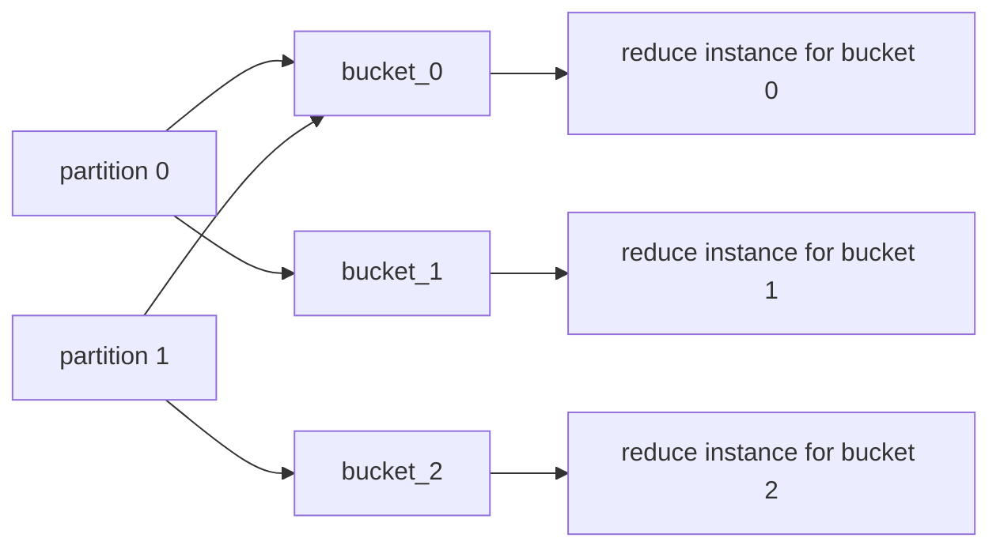
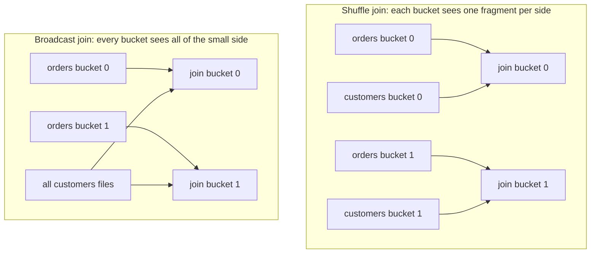

# The shuffle

The shuffle is the heart of any distributed query engine, and it is the thing this project most wants
to make visible. Everything here is ordinary Airflow tasks writing ordinary Parquet files.

## Map side: hash-partition into buckets

Each mapped stage instance, in its `write` task, routes every output row to a bucket:

```
bucket = blake2b(key values) % num_buckets
```

and writes one Parquet file per non-empty bucket, named `bucket_<n>.parquet`, into that instance's
output directory. It returns the list of files it wrote with a row count each.

Two details matter more than they look:

**The hash must be stable across processes.** Python's built-in `hash()` is randomized per process
via `PYTHONHASHSEED`, and every Airflow task is a separate process. Using it would send the same key
to different buckets in different tasks, splitting groups apart and producing wrong results. `blake2b`
over encoded bytes is stable everywhere. A unit-separator byte is written between fields so the
composite key `("a", "b")` cannot collide with `("ab",)`.

**Empty buckets are skipped.** A partition that produces no rows for bucket 5 writes no file for
bucket 5, and an empty table writes nothing at all. This keeps the reduce side from expanding over
partitions that would read nothing, and it is why the downstream planner can group by observed
bucket ids instead of a fixed range.

## Reduce side: gather by bucket

The planner task between stages collects every upstream file, groups the paths by bucket id, and
emits one entry per bucket — that list becomes the downstream stage's mapped instances. A bucket is
only emitted when *every* input table has files for it, which is exactly inner-join and
single-table semantics.



The bucket count is never required as an input. It is inferred from what the map side actually wrote,
which is what makes the next feature possible.

## Adaptive shuffle width

A fixed bucket count is wrong in one direction or the other: too few and each reduce task is huge,
too many and you pay Airflow's per-task overhead for tasks that process a handful of rows. A
`BucketingPolicy` lets the width be chosen at run time:

| Strategy | Width |
| --- | --- |
| `static` | Always `num_buckets` |
| `rows` | `ceil(total_rows / target_rows_per_bucket)`, capped at `num_buckets` |
| `bytes` | `ceil(total_bytes / target_bytes_per_bucket)`, capped at `num_buckets` |
| `partitions` | The number of source partitions, capped at `num_buckets` |

For the adaptive strategies, `num_buckets` is a **cap**, not a target. The result is always clamped
to at least 1.

The width planner runs before the map side and reads metadata only — Parquet footers, Iceberg
manifests — never data. Connectors expose this through `estimate_total_rows()` and
`estimate_total_bytes()`, and may return `None` when they cannot answer cheaply.

The practical effect: the same DAG fans out to a handful of tasks for a small input and to many for
a large one, and you can watch the width change between runs in the grid.

## Broadcast joins

Co-partitioning both sides of a join means shuffling both sides, and when one side is tiny that is
wasted work. If `broadcast_threshold` is set and the smaller side produced at most that many rows,
the join planner switches strategy: every populated bucket of the large side is joined against *all*
of the small side's files.

The decision uses the row counts the map side already reported through XCom, so it costs nothing
extra to make. Both strategies are correct for an INNER equi-join; only the data movement differs.
The chosen strategy is logged by the planner task, so the grid shows which one a given run picked.



## Internal exchange format

Parquet, always, through Airflow's `ObjectStoragePath`. Columnar and typed, so no schema is lost
between stages; supported natively by both Arrow and DataFusion, so there is no conversion cost; and
`ObjectStoragePath` means identical code paths for `file://` during local development and `s3://` in
a real deployment.

Everything else — paths, bucket ids, row counts — travels as small JSON-serializable dicts over
XCom, so no custom XCom backend is needed.
